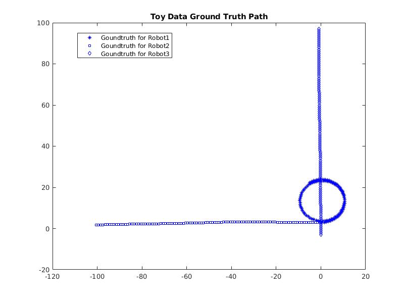

## Multi-Robots Localization based on Sensor Fusion and Relative Observations

Yingxue Wang, Lu Chen, Yuminghao Xiao, Jinrun Huang, Peter Wrobel

For NAVARCH 568 WN 2021 Final Project

Practical implementation of multi-robot localization task using Extended Kalman Filter(EKF) and Particle Filter(PF) with odometry data, landmark measurements and relative measurements.  

The implementation of EKF and PF correction step using relative robot location update follows the method proposed by <a href="https://ieeexplore.ieee.org/document/1570537">Martinelli et. al., 2005</a>. The filter update with fused relative measurements generally achieved better performance than the vanilla updates.

## Environment Setup

The code is tested on Matlab 2021a.

## Datasets

### Toy Data

The toy problem data is a synthetic data create by the project group. It is created by adding additional white noise to the synthetic control inputs and ground truth measurements of landmark and relative location. An example of generated toy data with 3 robots is shown below.

</img>

### UTIAS Multi-Robot Cooperative Localization and Mapping Dataset

We used the <a href="http://asrl.utias.utoronto.ca/datasets/mrclam/">UTIAS Multi-Robot Cooperative Localization and Mapping Dataset</a> for testing our implementation in a real-world scenario.

## Usage

Commands format:

```
run_fused(numSteps, filter_name, if_toy_prob)
```

`numSteps`: number of time step, e.g. 100

`filter_name`: 'EKF' or 'PF'.

`if_toy_prob`: true, or false.

Example command for EKF, using real data:
```
run_fused(100, 'EKF', false)
```
Example command for PF, using toy data:
```
run_fused(100, 'EKF', true)
```
